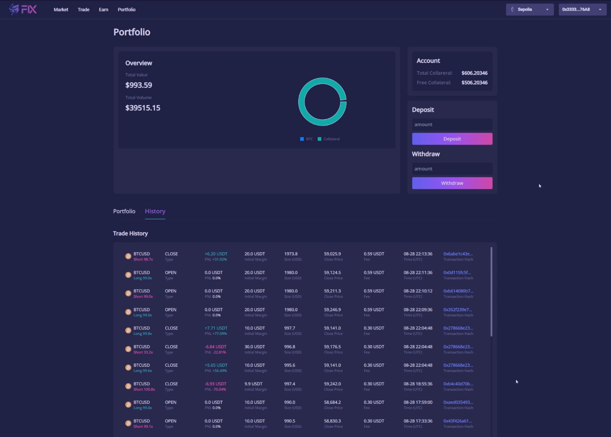
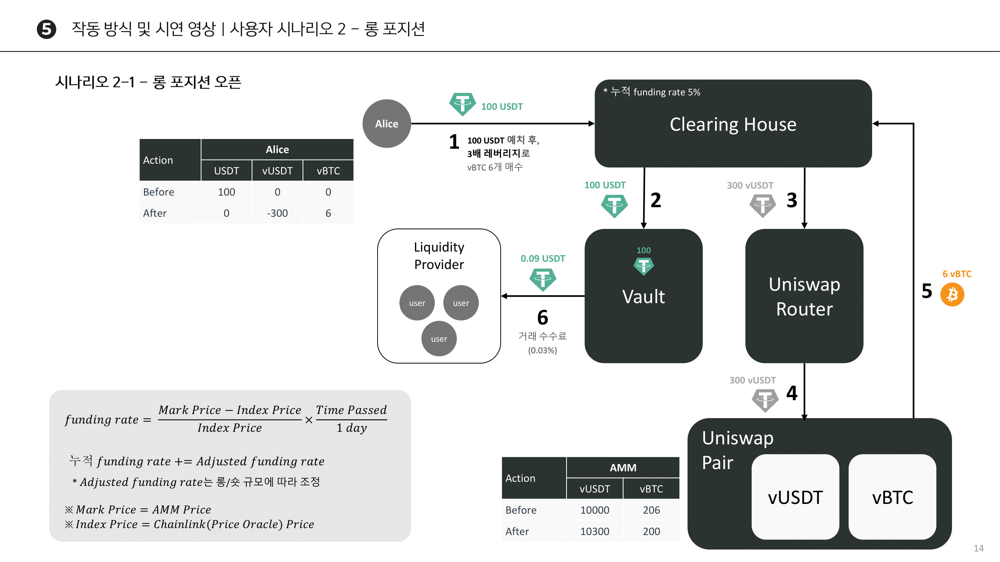
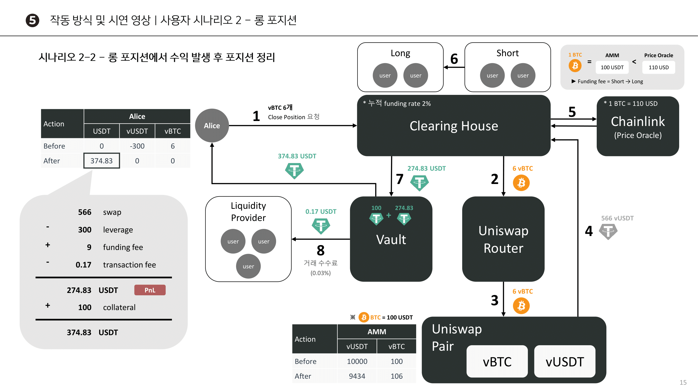

## 탈중앙화 선물 거래 플랫폼, FiX

**FiX** 프로젝트는 온체인 상에서 선물 거래를 할 수 있는 플랫폼입니다. 이 프로젝트는 블록체인 기술을 사용하여 중개인 없이 **안전하고 투명하게 거래**를 진행할 수 있도록 설계되었습니다.

- **보안성** : 사용자의 자산을 자체적으로 보유하며, 거래가 블록체인에서 실행되기 때문에 중앙화된 거래소처럼 해킹 위험이 적습니다.

- **투명성** : 모든 거래가 블록체인에 기록되므로, 거래 내역이 투명하게 공개됩니다. 이를 통해 거래 조작이나 내부 거래 등 부정 행위를 예방할 수 있습니다.

- **낮은 수수료**: 운영비용이 적게 들기 때문에 거래 수수료가 낮습니다. 또한, 중개자 없이 직접 거래가 이루어지기 때문에 추가 비용이 발생하지 않습니다.

 

### 개발 동기

> 기존 탈중앙화 선물 거래소에서는 높은 수수료 및 가스 사용량, 낮은 유동성으로 인해 중앙 선물 거래소보다 접근성이 어렵다고 생각했습니다.
>
> 저희는 가스 사용량을 낮춘다면, 트랜잭션 수수료를 낮출 수 있으며 이로 인해 시스템을 유지하기 위한 비용도 줄어들기 때문에 거래 수수료도 낮출 수 있으며, 진입 장벽을 낮춰 더 많은 거래가 체결되고 유동성 제공자들에게 많은 보상을 주게 된다면 많은 유동성을 모으고 낮은 슬리피지까지 기대할 수 있다고 생각합니다.

 
 

## 📌 목차

- [사용된 기술](#-사용된-기술)
- [주요 기능](#-주요-기능)
- [프로젝트 프로세스](#-프로젝트-주요-프로세스)
- [시연 영상](#-시연-영상)
- [개발자](#-개발자)

 
 

## 🔨 사용된 기술

 
 

## ✅ 주요 기능

- 유동성 추가/제거

  

- 거래 페이지

  

- 포트폴리오

  

 
 

## 🔍 프로젝트 주요 프로세스

 
 

## 🎥 시연 영상

  

## 👩‍💻 개발자

<table>
     <tr style="text-align:center;">
        <td>
        	민규선
        </td>
        <td>
            안성민
        </td>
        <td>
            전영호
        </td>
        <td>
            조재언
        </td>
    </tr>
     <tr style="text-align:center;">
        <td>
            
	        	
            
            
                <a href="https://github.com/gyuhaaa">gyuhaaa</a>
            
        </td>
        <td>
            
	        	
            
            
            	<a href="https://github.com/asm9677">asm9677</a>
            
        </td>
        <td>
            
	        	
            
            
	           	<a href="https://github.com/wndrbrwn">wndrbrwn</a>
            
        </td>
        <td>
            
	        	
            
            
	            <a href="https://github.com/Jo-Jae">Jo-Jae</a>
            
        </td>
    </tr>
</table>
